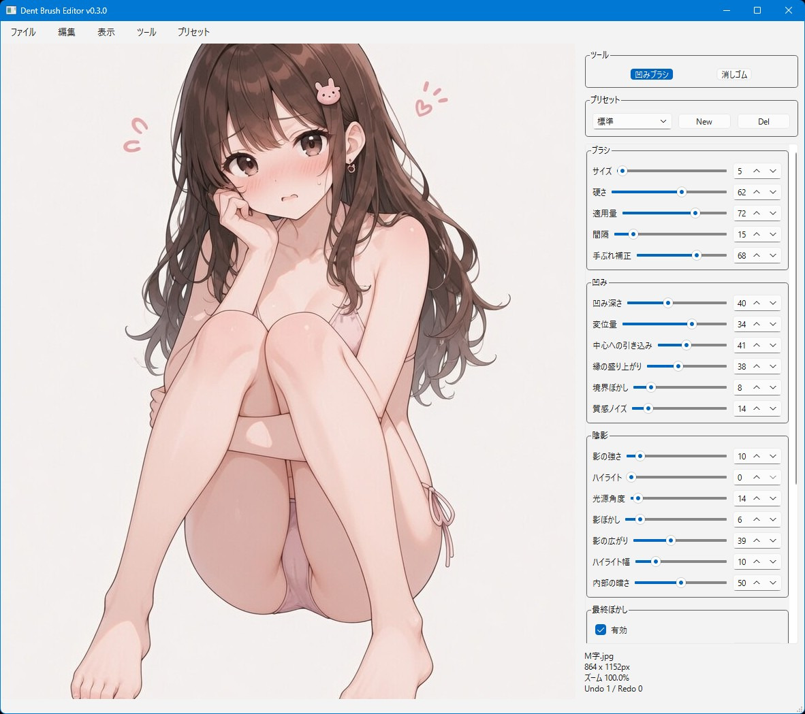

# Dent Brush Editor



## 機能概要

Dent Brush Editor は、画像をマウスでなぞった部分に「凹み」「押し込み」「食い込み」っぽい質感を付ける画像編集ツールです。
ブラシで描いた範囲に、変位・陰影・中心線・最終ぼかしを組み合わせて、へこんだような見た目を作れます。

### 主な機能

* 画像をドラッグ＆ドロップ、またはファイル選択で読み込み
* PNG / JPEG / WEBP / BMP に対応
* 日本語ファイル名・日本語フォルダ名などのUnicodeパスに対応
* マウスでなぞった部分に凹みエフェクトを適用
* ブラシサイズ、硬さ、適用量、間隔、手ぶれ補正を調整可能
* 凹み深さ、変位量、中心への引き込み、縁の盛り上がり、境界ぼかしなどを細かく調整可能
* 影、ハイライト、内部の暗さ、質感ノイズを調整可能
* 最終ぼかしフィルターで、凹ませた部分をあとから自然になじませることが可能
* ストローク中心線ベースの中心線フィルターに対応
* 中心線の太さ、色、不透明度を調整可能
* プリセットの追加・削除・名前変更に対応
* Undo / Redo 対応
* Before / After 表示対応
* PNG / JPEG / WEBP で書き出し可能
* 透過PNGのRGBA / alphaチャンネルを維持
* プロジェクト保存に対応
* 引いた線、読み込んだ画像、各種パラメータを `.dent.json` に保存可能
* 設定JSONをスクリプトと同じフォルダに保存

### 一言で言うと

「画像をなぞって、そこだけ凹ませたように加工するツール」

## 使い方

1. **アプリを起動する**

   必要なライブラリをインストールしてから、ターミナルで以下を実行します。

   ```bash
   python dent-brush-editor.py
   ```

2. **ファイルを読み込む**

   画像ファイルをウィンドウにドラッグ＆ドロップするか、メニューから画像を開きます。

   対応形式:

   * PNG
   * JPG / JPEG
   * WEBP
   * BMP

3. **設定を行う**

   右側のパネルで、凹み具合やブラシの挙動を調整します。

   主な設定項目:

   * ブラシサイズ
   * ブラシ硬さ
   * 適用量
   * 手ぶれ補正
   * 凹み深さ
   * 変位量
   * 中心への引き込み
   * 縁の盛り上がり
   * 境界ぼかし
   * 影の強さ
   * ハイライト
   * 内部の暗さ
   * 最終ぼかし
   * 中心線

   プリセットを使うと、よく使う設定をすぐ呼び出せます。
   `New` で現在の設定を新しいプリセットとして保存できます。

4. **プレビューを確認**

   キャンバス上でマウスをドラッグすると、なぞった部分に凹みエフェクトが適用されます。

   便利な操作:

   * 左ドラッグ: 凹みブラシ
   * 右ドラッグ: 表示位置の移動
   * ホイール: 拡大・縮小
   * `1`: 凹みブラシ
   * `2`: 消しゴム
   * `Ctrl+Z`: 元に戻す
   * `Ctrl+Y`: やり直し
   * `Tab`: Before / After 表示
   * `F`: 全体表示
   * `Ctrl+1`: 100%表示

5. **書き出しを実行する**

   メニューから画像を書き出すと、加工後の画像を保存できます。

   書き出し形式:

   * PNG
   * JPEG
   * WEBP

   また、作業状態をあとから再編集したい場合は、プロジェクトとして保存できます。
   プロジェクトファイルには、元画像、ストローク履歴、パラメータなどが保存されます。

## おすすめ設定例

まずは標準プリセットをベースにして、以下を少しずつ調整するのがおすすめです。

* 凹みを強くしたい: `凹み深さ` と `変位量` を上げる
* 自然になじませたい: `最終ぼかし` をONにして、サイズと強度を少し上げる
* 細い筋を入れたい: `中心線` をONにして、太さと不透明度を調整する
* くっきりさせたい: `境界ぼかし` を下げる
* やわらかくしたい: `境界ぼかし` と `最終ぼかし` を上げる

やりすぎると汚れやシミっぽく見えやすいので、最初は控えめな値から試すのが無難です。

## 必要環境

* Python 3.10以上
* PySide6
* numpy
* opencv-python
* Pillow

インストール例:

```bash
pip install PySide6 numpy opencv-python Pillow
```

## ライセンス

**MIT License** で公開しています。
ご自由に使って、改変して、参考にしてください。
ただし**自作発言はNG**でお願いします。
